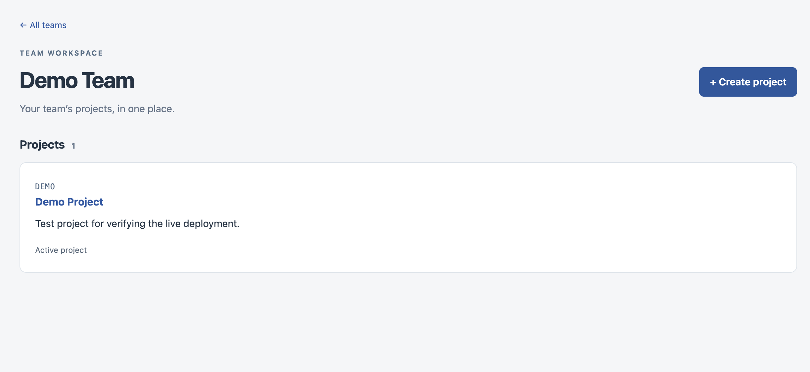
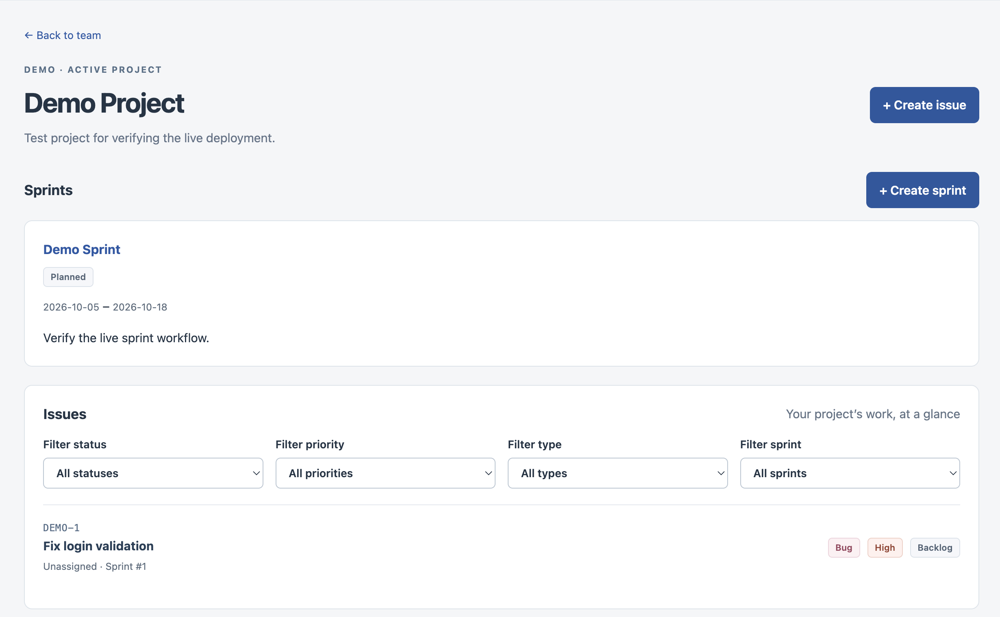
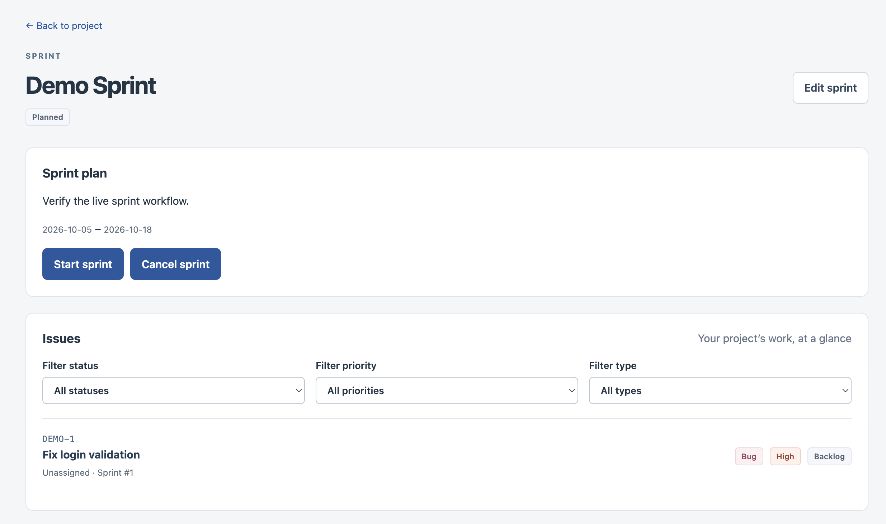
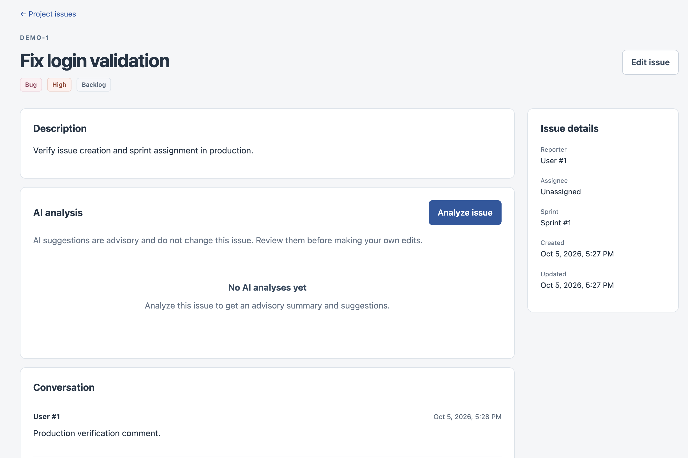
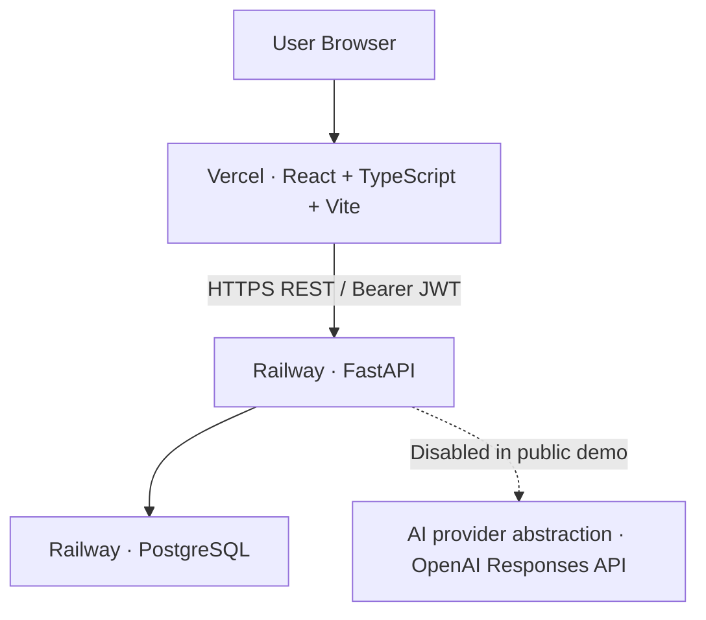

# AI-Powered Software Project Management Platform

A deployed full-stack workspace for software teams to plan sprints, track issues,
collaborate, and review optional AI-assisted triage suggestions.

**Status:** V1 implemented and deployed · **Core stack:** React, TypeScript,
FastAPI, PostgreSQL

## Live Demo

- [Live Demo — Web App](https://ai-project-management-platform-ebon.vercel.app)
- [API Health](https://backend-production-b30f.up.railway.app/api/v1/health)

The React/Vite frontend is hosted on Vercel; the FastAPI backend and PostgreSQL
are hosted on Railway. **AI is intentionally disabled in the current public
demo.** The core application remains usable without an AI provider configured.

## Key Features

- JWT authentication with Argon2 password hashing.
- Team workspaces, role-based memberships, and project-level access control.
- Sprint creation, metadata editing, and start/complete/cancel lifecycle actions.
- Bugs, features, and tasks with assignment, workflow status, and combined filters.
- Issue comments and an append-only history of issue changes.
- Optional advisory AI summaries, type/priority suggestions, and immutable analysis history.
- Responsive React frontend with reusable forms, protected routes, and validated API responses.

Membership management and comment edit/delete operations exist in the API;
their frontend administration controls are deferred.

## Screenshots

### Team Workspace



### Project Workspace



### Sprint Management



### Issue Detail and AI Analysis



## Architecture



The backend enforces authorization through team and project membership. Alembic
manages schema migrations, and the frontend validates API responses with Zod.
AI analysis is advisory: it never automatically changes issues or their activity.

## Tech Stack

| Layer | Technologies |
| --- | --- |
| Backend | Python, FastAPI, SQLAlchemy 2.x, PostgreSQL, Alembic, Pydantic, JWT, Argon2 |
| Frontend | React, TypeScript, Vite, React Router, Axios, Zod |
| Testing | pytest, Vitest, React Testing Library |
| Infrastructure | Docker, Docker Compose, nginx, GitHub Actions, Railway, Vercel |
| Optional AI | Provider abstraction, OpenAI Responses API adapter, validated structured output |

## Testing and Quality

The latest verified baseline contains **580 passing backend tests** and
**83 passing frontend tests**. Backend tests use isolated SQLite databases;
frontend tests use a mocked Axios transport. AI tests use deterministic providers
and mocked HTTP without live provider calls.

CI checks backend tests, Alembic migrations against an empty PostgreSQL database,
frontend typechecking, tests and production builds, Compose configuration, and
both Docker image builds. Test commands are included below. A browser E2E suite
is not currently implemented.

## Local Development

### Backend

Requires Python 3.13+; PostgreSQL is the runtime database.

```bash
cd backend
python -m venv .venv
source .venv/bin/activate
pip install -r requirements.txt
python -m pytest
```

Tests use isolated configuration and SQLite in memory; no PostgreSQL is needed.
For local startup, set `DATABASE_URL` and `JWT_SECRET_KEY` in your environment or copy `.env.example`
to `.env` and replace its example credentials and secret. Use a unique random
JWT secret of at least 32 characters. `JWT_ALGORITHM` is `HS256` and
`ACCESS_TOKEN_EXPIRE_MINUTES` defaults to 30 (must be positive). Environment variables override
`.env`. `APP_NAME`, `ENVIRONMENT`, and `API_V1_PREFIX` have development defaults.

With PostgreSQL available and configuration set, apply the migration explicitly:

```bash
alembic upgrade head
uvicorn app.main:app --reload
```

### Frontend

Use Node.js 22.12+ (a current supported LTS release is recommended). From the
repository root:

```bash
cd frontend
npm ci
npm run dev
```

Open http://127.0.0.1:5173. The API defaults to
`http://localhost:8000/api/v1`. To change it, copy `frontend/.env.example` to
`frontend/.env`, set `VITE_API_BASE_URL`, and restart Vite. Vite variables are public
build-time values; never put secrets in them. `npm ci` installs the dependencies
recorded in `package-lock.json`.

In a separate terminal, configure the backend as described above, then run:

```bash
cd backend
source .venv/bin/activate
export CORS_ALLOWED_ORIGINS='["http://localhost:5173","http://127.0.0.1:5173"]'
alembic upgrade head
uvicorn app.main:app --reload
```

`CORS_ALLOWED_ORIGINS` accepts a JSON array of explicit HTTP(S) origins. It defaults
to an empty list; the backend environment example lists the two local Vite origins.
Cookies/credentialed CORS are disabled; authentication uses an Authorization
Bearer header. Configure explicit origins for other environments.

## Backend / API Details

`GET /api/v1/health` returns `{"status":"ok"}` without opening a database
connection. Application initialization validates configuration without connecting
to PostgreSQL or creating tables; the container startup command runs migrations
separately. Alembic uses the application database URL and tracks schema versions; `alembic history` shows the migration history. Users, teams, projects,
their memberships, and project-scoped sprints are modeled.

### Authentication

Authentication accepts JSON at `POST /api/v1/auth/register` (first name, last name,
email, password) and `POST /api/v1/auth/login` (email, password). Registration
requires an 8–128 character password; passwords are stored as Argon2 hashes.
Login returns a Bearer JWT for `GET /api/v1/auth/me`. Responses never include
passwords or hashes. Duplicate registration returns 409; invalid credentials,
inactive accounts, and missing/invalid tokens return 401. There are no global
roles; authorization is enforced through team and project memberships.

### Teams

Team endpoints under `/api/v1/teams` support creation/listing (`POST`/`GET`),
viewing/updating metadata (`GET`/`PATCH /{team_id}`), and member listing/adding
(`GET`/`POST /{team_id}/members`). Update roles or remove memberships with
`PATCH`/`DELETE /{team_id}/members/{user_id}`; removal returns 204.
Creation atomically makes the creator the sole owner. Owners manage admins and
members; admins manage ordinary members only. All members can read their team,
and owners/admins can update metadata. Outsiders receive 404 to hide team existence.
Adding by email requires an existing user. Assigning, removing, or demoting
the owner returns 400. Ownership transfer
and team deletion are not implemented in V1. Apply migration `0002` with the same
`alembic upgrade head` command.

### Projects

Projects belong to one team. Create/list them at
`POST`/`GET /api/v1/teams/{team_id}/projects`; view/update them at
`GET`/`PATCH /api/v1/projects/{project_id}`. Membership endpoints are
`GET`/`POST /api/v1/projects/{project_id}/members` and
`PATCH`/`DELETE /api/v1/projects/{project_id}/members/{user_id}` (DELETE returns 204).
Creation requires a team owner/admin and atomically makes the creator a project
manager. Project keys are required, normalized to uppercase, unique per team,
and contain 1–20 alphanumeric characters starting with a letter. The documented
`is_active` field defaults true; it is metadata, not an access-control switch.
Team owners/admins have administrative access to every project in their team.
Other team members see only assigned projects: project managers manage metadata
and membership; project members have read access. Adding a member by `user_id`
requires existing team membership. Remove project memberships before removing a
user from the team. Multiple managers are allowed, but removing/demoting the last
manager returns 400. Project deletion is not implemented. Apply migration `0003`
with `alembic upgrade head`.

### Sprints

Sprints belong to projects: `POST`/`GET /api/v1/projects/{project_id}/sprints`
create/list them; `GET`/`PATCH /api/v1/sprints/{sprint_id}` retrieve/update them.
Project managers and parent-team owners/admins can create/update; authorized
project readers can read/list. Project `is_active` remains metadata and does not
change these permissions. New sprints start `planned`; transitions are
`planned → active/cancelled` and `active → completed/cancelled`. Terminal statuses
cannot reopen; metadata remains editable. Names may repeat, goals are optional,
and required dates permit same-day sprints. Dates never change status automatically.
No sprint deletion is implemented. Apply migration `0004` with `alembic upgrade head`.

### Issues

Issues belong to projects. All authorized project readers can create and edit
issues. Types are `bug`, `feature`, and `task`; priorities are `low`, `medium`
(default), `high`, and `critical`. Status defaults to `backlog`; `todo`,
`in_progress`, `in_review`, `done`, and `cancelled` are also supported, with free
transitions in V1. Project-local immutable numbers start at 1; `issue_key` derives
from the current project key and number (for example `API-17`). The authenticated
creator is the reporter (`created_by_id` in storage, `reporter_id` in responses).
Optional assignees must be explicit ProjectMembers; optional sprints must belong
to the same project. Both may be cleared with null.

Use `POST`/`GET /api/v1/projects/{project_id}/issues` and
`GET`/`PATCH /api/v1/issues/{issue_id}`. Lists sort by number and support exact
`status`, `priority`, `issue_type`, `assignee_id`, and `sprint_id` filters.
Apply migration `0005` with `alembic upgrade head`. Issue deletion is not implemented.

### Comments and activity

Issue comments: `POST`/`GET /api/v1/issues/{issue_id}/comments` allow authorized
issue users to create/list comments. Only the author with current issue access
may `PATCH`/`DELETE /api/v1/issues/{issue_id}/comments/{comment_id}`.
`GET /api/v1/issues/{issue_id}/activity` returns append-only history: one creation
event and one entry per changed issue field, committed atomically with the issue.
No-op updates add nothing; comment actions remain separate from field history.
Apply migration `0006` with `alembic upgrade head`.

### Optional AI analysis

AI issue analysis is advisory only: it summarizes the issue, suggests its type
and priority, and gives a concise priority explanation. It never changes Issue
fields or IssueActivity. Authorized issue users may call
`POST /api/v1/issues/{issue_id}/ai/analyze` with no body, then
`GET /api/v1/issues/{issue_id}/ai/analyses` for immutable history.
Responses preserve the documented `suggested_type`, `explanation`, and
`model_name` fields. Apply migration `0007` with `alembic upgrade head`.

AI is disabled by default. In the environment or backend `.env`, set
`AI_PROVIDER=openai`, `AI_MODEL` to a Responses API model supporting Structured
Outputs, and `OPENAI_API_KEY` to your own secret. `AI_TIMEOUT_SECONDS` defaults
to 30 (positive, at most 120). Never commit the real key. Missing AI configuration
returns 503 only on analysis execution; history and other endpoints remain usable.
The OpenAI adapter uses the existing HTTPX dependency, strict JSON schema output,
and sends only issue title/description as untrusted data. No vendor SDK is needed.
It disables response storage and does not retry requests. Provider failures return
safe 502/503 errors. No database transaction is held during the external call;
access is rechecked before saving. Results describe the input read at request time,
which may have since changed. Tests use deterministic providers and mocked HTTP,
with live HTTP transport blocked; no API account/key is required for pytest.

## Frontend Details

The V1 frontend uses React, strict TypeScript, Vite, React Router, Axios, and Zod
response validation. It includes registration/login, teams and project navigation,
team/project creation, issue lists with status/priority/type filters, issue
creation/editing, comments, and read-only activity. Assignment selectors use
existing project-member and sprint APIs. User IDs are shown where the API does
not provide names. Comment edit/delete controls, membership administration,
and analytics are intentionally deferred.

Project pages now list and create sprints; sprint details support metadata edits,
start/complete/cancel actions, and server-filtered sprint issues. Planned sprints
can start or cancel; active sprints can complete or cancel. Terminal sprints retain
editable metadata. Management requires project manager or parent-team owner/admin
permissions, enforced by the backend; permission errors stay local in the UI.
Date-only values display without timezone conversion. Project issue filters now
include sprint alongside status, priority, and type. Lifecycle actions never
reassign or update issues.

Issue details also support requesting AI analysis and viewing immutable history,
newest first, with advisory summaries, suggested types/priorities, and explanations.
AI never automatically modifies Issues or activity; normal editing stays separate.
Provider configuration and API keys remain backend-only. With AI unconfigured,
the analysis action shows a safe error while history and normal issue features remain usable.

Authentication uses a single sessionStorage token module: boot verifies `/auth/me`,
logout removes the token, and an authenticated request returning 401 clears the
session and redirects to login. Passwords are never persisted. sessionStorage
limits persistence to the browser tab but is still accessible to JavaScript;
HttpOnly cookie authentication would require a future backend change. Registration
creates an account and then directs the user to sign in.

Frontend verification (no running backend needed for tests):

```bash
cd frontend
npm run typecheck
npm run build
npm test -- --run
```

Vitest, React Testing Library, and user-event exercise flows through a mocked Axios
transport. No ESLint configuration or lint script is currently included.
Build output, dependencies, coverage, caches, and real environment files are ignored.

## Production Deployment

The public application uses HTTPS endpoints:

| Service | Hosting / public endpoint |
| --- | --- |
| Frontend | Vercel — [Web App](https://ai-project-management-platform-ebon.vercel.app) |
| Backend | Railway — [API](https://backend-production-b30f.up.railway.app) |
| Database | Railway PostgreSQL; no public application link |

The frontend uses its public API URL through the build-time `VITE_API_BASE_URL`.
The backend allows the explicit Vercel frontend origin through
`CORS_ALLOWED_ORIGINS`; database credentials and provider keys stay server-side.
The committed Vercel SPA rewrite serves `index.html` for React Router deep links.
The backend container applies Alembic migrations before starting Uvicorn and
stops if migration execution fails. AI remains disabled in the public demo.

Local production-style Docker Compose remains supported independently of this
hosted deployment.

## Local Production-style Docker Stack

Requires Docker with Compose. From the repository root:

```bash
docker compose up -d --build --wait
docker compose ps
```

Open http://localhost:8080; the browser calls the API directly at
http://localhost:8000/api/v1 (health: `/api/v1/health`). Host ports bind only to
loopback. PostgreSQL is private to the Compose network. nginx serves built assets
and falls back to index.html for React Router deep links. Neither service uses
hot reload; both application containers run as non-root users.

Compose uses Python 3.13, Node 22 for the frontend build, PostgreSQL 17, and stable
nginx. The backend applies existing Alembic migrations before starting Uvicorn;
migration failure stops startup. For multiple replicas, use one dedicated
migration/release step before starting API replicas instead of concurrent startup
migrations. Healthchecks verify PostgreSQL readiness, backend HTTP responsiveness,
and frontend static serving; they do not depend on AI availability.

Stop containers with `docker compose down`. Database data remains in the named
`postgres_data` volume. **Only when intentionally discarding all local Docker
database data**, use `docker compose down -v`. No application data is seeded.

Compose defaults are local-only examples: the database password and JWT secret
must be replaced before hosting. Override `COMPOSE_DB_PASSWORD` and
`JWT_SECRET_KEY` through the environment or an ignored root `.env`.
Use a URL-safe database password for this Compose URL interpolation. Changing the
password on an existing volume also requires changing the database role password.
The standalone backend image requires `DATABASE_URL` and a unique
`JWT_SECRET_KEY` of at least 32 characters; see `backend/.env.example` for other
settings. Compose uses explicit local frontend CORS origins; set
`CORS_ALLOWED_ORIGINS` to a JSON array of your frontend origins when hosting.
The supplied healthcheck expects the default `/api/v1` API prefix.

`VITE_API_BASE_URL` is public **build-time** configuration. Compose forwards it as
a frontend build argument; rebuild the frontend after changing it. For example:

```bash
docker build --build-arg VITE_API_BASE_URL=https://api.example.com/api/v1 frontend
```

Use a browser-reachable API URL, not the Compose service hostname. Runtime
environment changes cannot rewrite the built JavaScript. Never put database
credentials, JWT secrets, or provider keys in frontend variables/build arguments.

AI is disabled by default and normal functionality remains available.
Optional `AI_PROVIDER`, `AI_MODEL`, `OPENAI_API_KEY`, and `AI_TIMEOUT_SECONDS`
are passed only to the backend. No real secrets or environment files are baked
into either image. Avoid sharing resolved `docker compose config` output when
using real environment values because it can contain secrets.

## Continuous Integration

GitHub Actions runs on pushes to main and pull requests targeting main, with
read-only repository permissions. Independent jobs run backend pytest and apply
Alembic migrations to an empty PostgreSQL database; install frontend dependencies
with `npm ci`, typecheck, test, and build; and validate Compose plus build both
container images. CI uses disposable example credentials and no live AI keys.
This validation workflow does not publish images or deploy services.

## V1 Scope / Deferred Features

The implemented V1 covers authentication, team/project workspaces, sprint planning,
issue workflows, collaboration, and optional advisory AI analysis. Deferred work
includes kanban drag/drop, advanced analytics and dashboards, notifications,
realtime updates, GitHub integration, attachments, time tracking, billing, and a
mobile application. Membership administration UI and comment editing/deleting UI
are also deferred; their backend operations already exist.

See [V1 scope](docs/v1-scope.md), [data model](docs/data-model.md), and
[architecture](docs/architecture.md) for design details and longer-term plans.
